# A Framework for Supervised and Unsupervised Segmentation and Classification of Materials Microstructure Images

## Requirements

To install requirements:

```setup
pip install -r requirements.txt
```

## Terminlogoy:
### HR (Homogeneous Region):
A region where microstructure stochastic nature is homogeneous.
### MC (Microstructure Class): 
A specific class of stochastic nature of a microstructure within a specific HR.

## Step 1: 
In an unsupervised manner, diagnose multiphase nonstationary behavior in micrographs using a recently-developed score-based nonstationarity diagnostic (ND) method. Specifically, we fit a single supervised learning model to a set of training micrograph(s), apply the model to predict each pixel of the training micrograph(s) to obtain score vectors pixel-by-pixel, and then cluster score vectors to segment HRs corresponding to distinct MCs.

To train the model(s) and plot results:

| Data set name         | Commend  |
| :------------------ | :---------------- |
| Silica particles in PMMA with octyl functional modification   |     python -uB ./Nonstationarity_Diagnostics/single_sim_call.py --model_file_folder='\${RES_FOLDER_PATH}\${IDX}_sim_reg/' --nnet=0 --alarm_level=99.0 --single_exp_plot=3131 --model_idx=5 --reg_model='lin' --wind_hei=5 --wind_wid=5 --spatial_ewma_sigma=30 --spatial_ewma_wind_len=30 --nois_sigma=0.1 --intcp=0 --z_scale=0 --cv_flag=0 --max_steps=50000 --stopping_lag=1000 --activation='sigmoid' --materials_model="non_causal" --training_rounds=1 --n_comp=2 --real_img_path='Data/texture/Octyl_images/003_cropped.tif'         |
||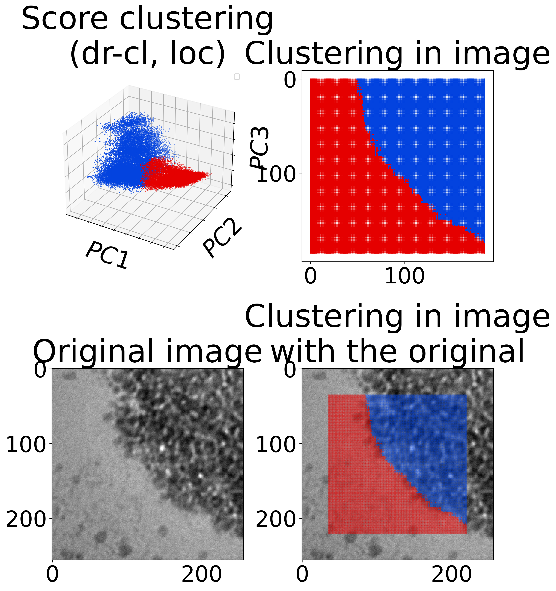|
|Duel-phase steel | python -uB ./Nonstationarity_Diagnostics/single_sim_call.py --model_file_folder='\${RES_FOLDER_PATH}\${IDX}_sim_reg_nnet/' --nnet=1 --alarm_level=99.0 --single_exp_plot=3131 --model_idx=5 --reg_model='nnet_lin' --wind_hei=5 --wind_wid=5 --spatial_ewma_sigma=30 --spatial_ewma_wind_len=30 --nois_sigma=0.1 --intcp=0 --z_scale=0 --cv_flag=0 --max_steps=10000 --activation='sigmoid' --materials_model="non_causal" --training_rounds=3 --n_comp=2 --penal_param=0.01 --learning_rate=1e-05 --stopping_lag=1000 --training_batch_size=100 --real_img_path='Data/texture/TwoPhase_images/gr1.jpg'|
||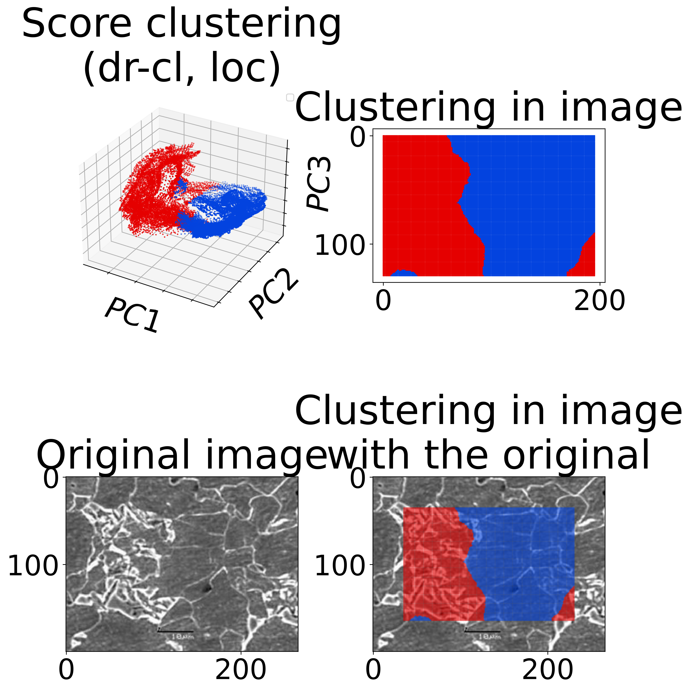|
|Brodatz collage | python -uB ./Nonstationarity_Diagnostics/single_sim_call.py --model_file_folder='\${RES_FOLDER_PATH}\${IDX}_sim_reg_nnet/' --nnet=1 --alarm_level=99.0 --single_exp_plot=3131 --model_idx=5 --reg_model='nnet_lin' --wind_hei=5 --wind_wid=5 --spatial_ewma_sigma=20 --spatial_ewma_wind_len=20 --nois_sigma=0.1 --intcp=0 --z_scale=0 --cv_flag=0 --max_steps=10000 --activation='sigmoid' --materials_model="non_causal" --training_rounds=3 --n_comp=2 --penal_param=0.01 --learning_rate=1e-05 --stopping_lag=1000 --training_batch_size=100 --real_img_path='Data/texture/TwoPhase_images/gr1.jpg'|
||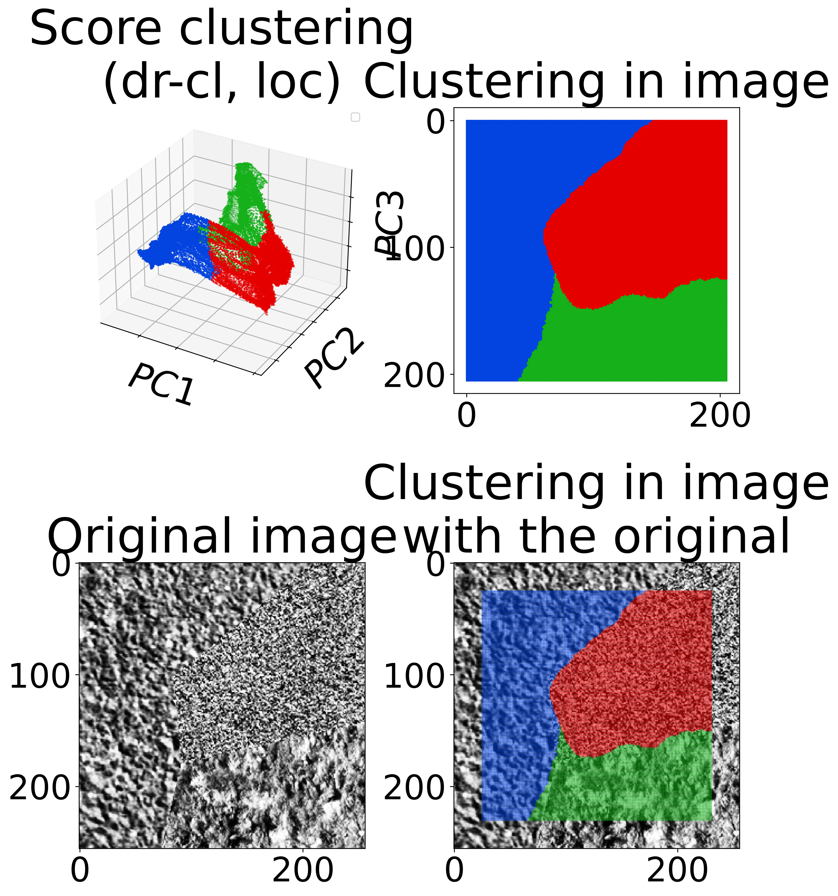|


## Step 2:
The extracted HRs from Step 1 are either classified as one of the previously identified and analyzed MCs in the database or determined to be a new MC not previously cataloged. To do this, the algorithm predicts which existing MC a target HR belongs to and ranks the different MCs based on similarity to the target HR. If the target HR is concluded to be different from any existing MC, with minimal human inspection (only to verify if the target HR is a new MC), the new MC is integrated into the database. This largely shifts the burdens of screening/memorizing morphologies and patterns of MCs from humans to algorithms and thus accelerates discovery/identification of new materials.

To train the model(s) and plot results:

| Data set name         | Commend  |
| :------------------ | :---------------- |
| Kylberg texture data set| python -uB ./Classification/finetune.py --model_name='kylberg_pre_trained' --weights_path='./Classification/bvlc_alexnet.npy' --num_epochs=10 --postfix=postfix --weight_decay=0.0005 |
|||


## Step 3:
A supervised segmentation network is used to segment multiphase materials, so that pixel-wise classifications for MCs are generated. The input to this segmentation network is a micrograph and the output is an image of the same spatial size as the input micrograph with each pixel replaced with the MC label to which the microstructure at that pixel belongs. This step reaches a pixel-wise accuracy higher than the unsupervised ND method in Step 1 and also has the capabilities of segmentation near borders of micrographs and faster segmentation of new multiphase micrographs after the model is trained. To this aim, we can either use i) data sets with full pixel-wise annotations which are usually costly; or ii) a database of homogeneous microstructures obtained in Step 2 for which pixel-wise annotations are automatically obtained and from which multiphase micrographs with pixel-wise annotations can be easily generated to improve the model training.

To train the model(s) and plot results:

| Data set name         | Commend  |
| :------------------ | :---------------- |
| UHCSA data set| python -uB ./finetune_cv_deeplab3plus_seg.py --model_name=DeepLab3PlusModified --last_idx_valids=12 --postfix=postfix --start_rd=0 --start_model_path="" --gen_fd_prefix=gen_fd_prefix --n_threads=${CORE} --backbone=xception --sample_wei_flag=1 --norm_data=0 --weight_decay=0.001 --start_fold_idx=0 --end_fold_idx=1 --accu_step=0 --init_valid_step=10 |
||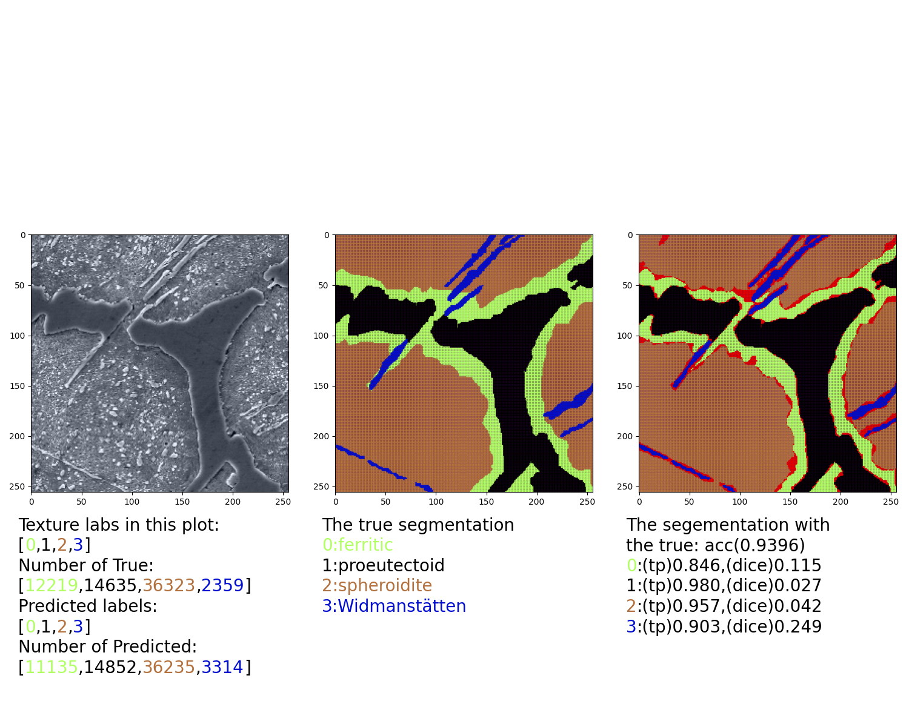|
||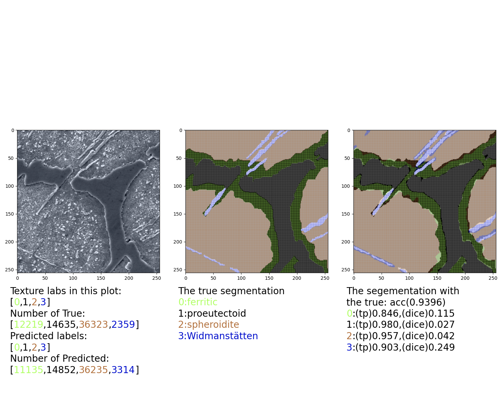|
||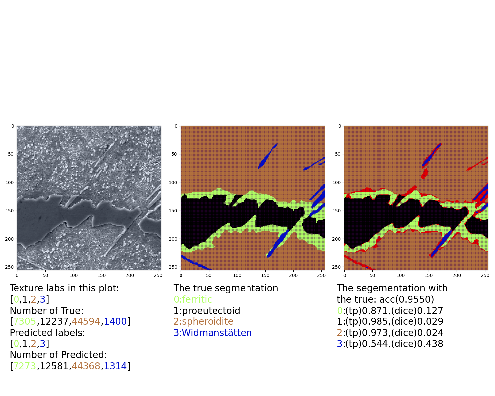|
||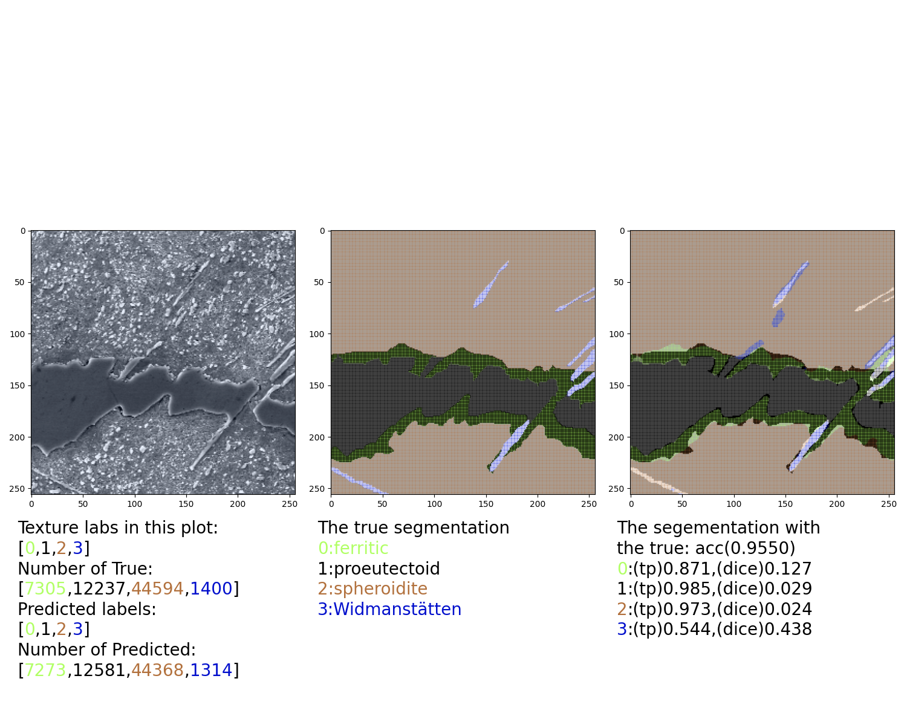|
||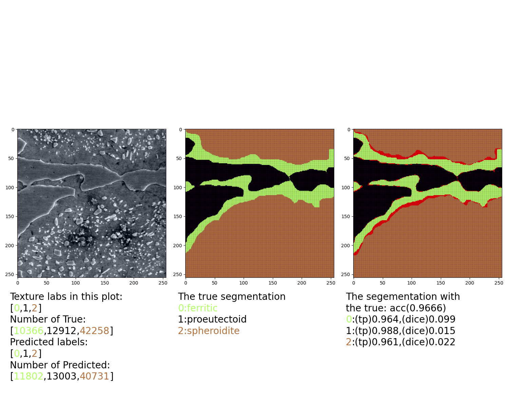|
||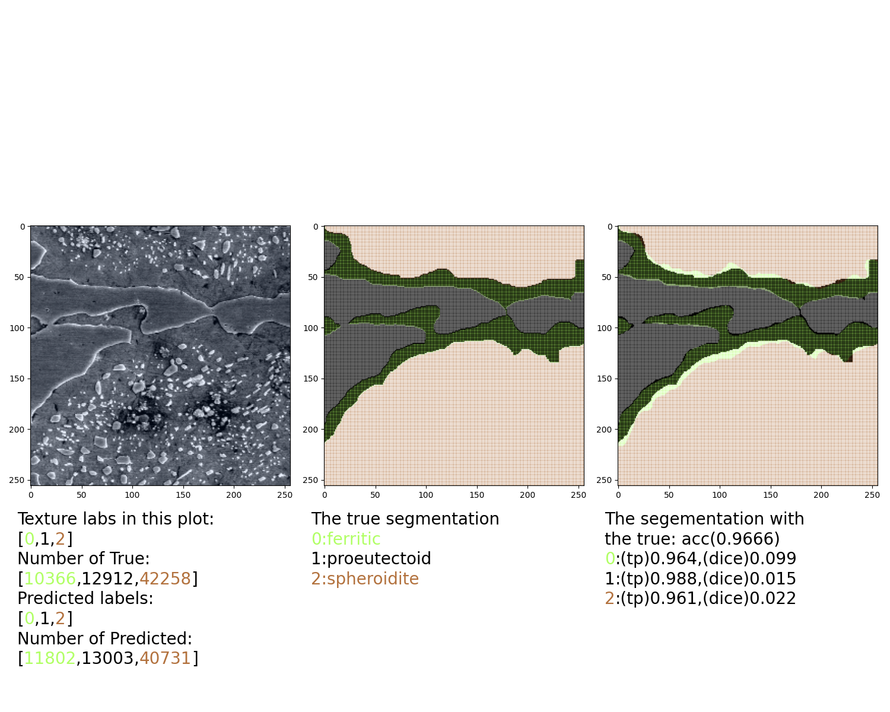|
||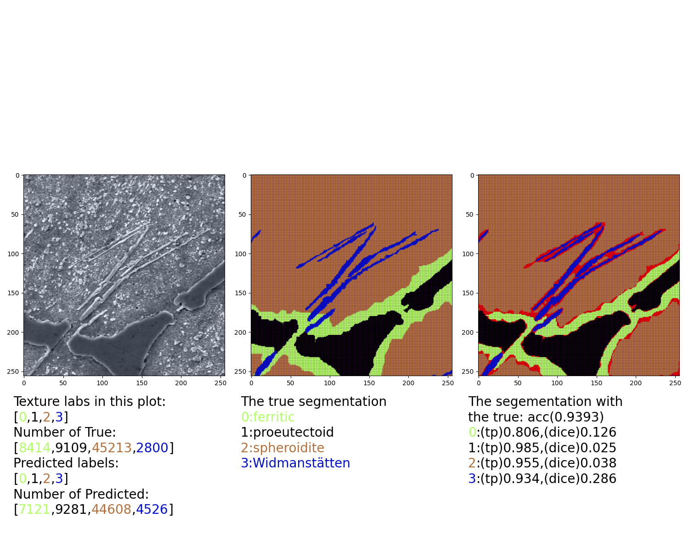|
||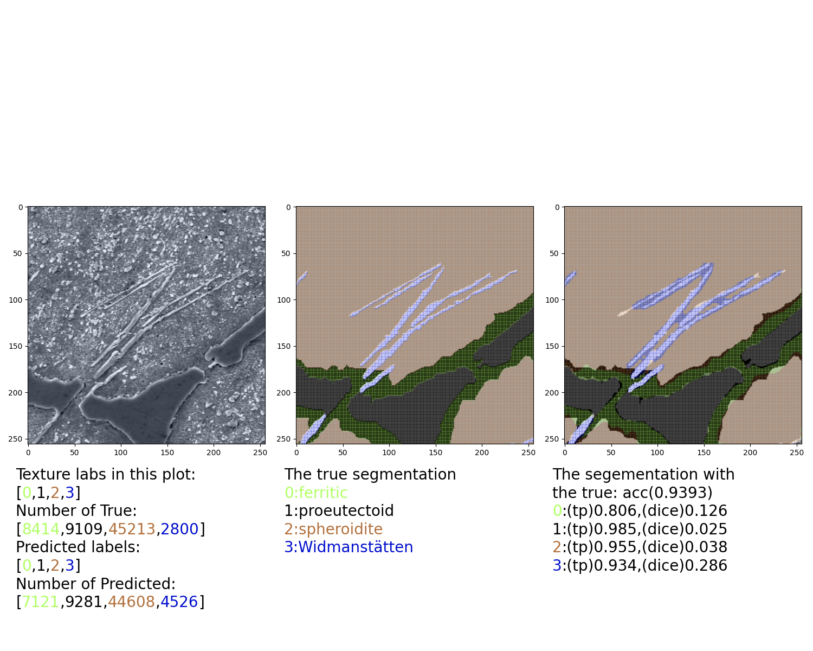|


## Iteration over steps 1-3
The previous three steps can be applied either i) for a specific study that is only interested in analyzing a specific data set without considering gradually extending the analysis to other micrographs to be collected in the future, or ii) when micrographs are collected regularly over time and a continuous integration of new materials is desired. Most existing approaches cannot be applied to the second situation, which is more consistent with the way new materials are designed: iteratively improving the design so that knowledge previously learned can be incorporated in each iteration. For example, MCs of previously designed multiphase micrographs can be classified faster and analyzed (segmented) better so that in the next round of design relevant properties of multiphase materials (e.g., the volume fraction of a certain phase that determines materials physical properties) can be more precisely controlled and utilized. For this class-incremental learning, to make the learning loop more efficient, models in Steps 2 and 3 can be trained more quickly, through transfer learning techniques of DL, than training from scratch every time a new batch of micrographs is obtained. For example, if new materials are included in the incoming batch, the number of MCs in the current database increases. Assuming the newly incoming MC is the $(k+1)^{\mathrm{st}}$ class, to obtain a network that can also characterize this class including the previous $k$ classes, the training can start with the existing network (the CNN or segmentation network) and can retain the weights already learned in the architecture; then in the last layer where the network outputs $k$ channels for the $k$ existing classes, another channel with random initial weights can be added (resulting in total $k+1$ channels) and the training process continues from here. We show later that this is consistently better than training-from-scratch, in which new networks are trained with all weights randomly initialized.

